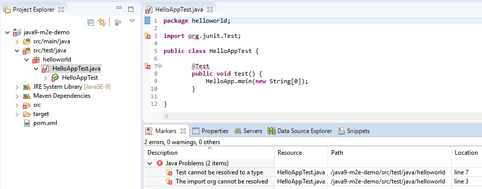

# java9-m2e-demo

This very simple Java 9 Maven project causes the following error when imported (as an existing Maven project) into Eclipse Oxygen 2 with Oracle JDK 9.0.1:
  


However it is compiling and running unit tests correctly with Maven 3.5.2.

**module-info.java** does not require JUnit:
```java
module helloworld.java9demo {

    exports helloworld;

}
``` 

and **pom.xml** is declaring the JUnit dependency:
```xml
<dependency>
	<groupId>junit</groupId>
	<artifactId>junit</artifactId>
	<version>4.12</version>
	<scope>test</scope>
</dependency>
``` 

